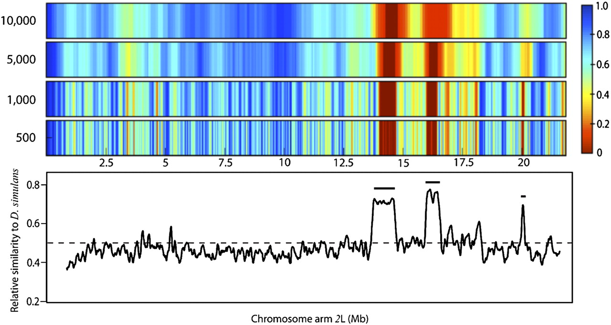

```{r setup, include=FALSE}
require("knitr")
knitr::opts_chunk$set(echo = T)
#knitr::opts_knit$set(root.dir='/proj/cdjones_lab/csoeder/PopPsiSeq/')


#knitr::opts_knit$set(root.dir=normalizePath("/proj/cdjones_lab/csoeder/legacyPopTest/PopPsiSeq/"))
knitr::opts_knit$set(root.dir=normalizePath(peaDubDee))

#knitr::opts_knit$set(root.dir=peaDubDee)
```

```{r dependencies, include=FALSE}

library("tidyverse")
#require(devtools)
#install_version("ggplot2", version = "3.1.0", repos = "http://cran.us.r-project.org")
library("knitr")
library("gt")
library("yaml")
library("ggbio")
library("readr")
library("reshape2")
library("ggdendro")
library("dendextend")
library("grid")
library("gridExtra")
#library("gtable")
library("rtracklayer")

library("patchwork")
library("ggplotify")
library("ggrepel")
library("ggarchery")

library("patchwork")

# gotta set the working directory.....
#knitr::opts_knit$set(root.dir='/proj/cdjones_lab/csoeder/PopPsiSeq/')


```

```{r initialize, include=FALSE}
print(getwd())
# 
human_readable_croncher <- function(num_in) {
	dig <- 3
	num_out <- formatC(num_in, digits=dig, format='g') %>% as.numeric() %>% sitools::f2si()
	return(num_out)
}

bam_summary_loader <- function(filename, aligner="bwa", reference='dm6'){
	
	tmp.df <- read_delim(filename, "\t", escape_double = FALSE, col_names = FALSE, trim_ws = TRUE)
	names(tmp.df) <- c("sample","measure","value")
	
	tmp.df$sample <- as.factor(tmp.df$sample)
	tmp.df$measure <- as.factor(tmp.df$measure)
	tmp.df$aligner <- as.factor(aligner)
	tmp.df$reference <- as.factor(reference)
	
	return(tmp.df)
	
}


psiSeq_loader <- function(filename){
  
  windowedPsiSeq.bg <- import.bedGraph(filename)#, genome=refgen)

  names( mcols( windowedPsiSeq.bg)) <- c("score", "shared","total")
mcols( windowedPsiSeq.bg)$shared <- as.numeric(mcols(windowedPsiSeq.bg)$shared)
mcols( windowedPsiSeq.bg)$total <- as.numeric(mcols(windowedPsiSeq.bg)$total)
windowedPsiSeq.bg$ratio <-windowedPsiSeq.bg$shared / windowedPsiSeq.bg$total

  return(windowedPsiSeq.bg)
}


freqShift_loader <- function(filename, refgen = "dm6", p1 = "sim", p2= "sec"){
  
  windowedFreqShift.bg <- import.bedGraph(filename)#, genome=refgen)

  enhancement_col <-  paste("sum_",p1,"_deltaF", sep = "")
  depletion_col <- paste("sum_",p2,"_deltaF", sep="")

  names(mcols(windowedFreqShift.bg)) <-  c("score", enhancement_col, depletion_col, "num_snp")


  mcols(windowedFreqShift.bg)[[enhancement_col]] <- as.numeric(mcols(windowedFreqShift.bg)[[enhancement_col]])
  mcols(windowedFreqShift.bg)[[depletion_col]] <- as.numeric(mcols(windowedFreqShift.bg)[[depletion_col]])

  mcols(windowedFreqShift.bg)[[paste("avg_",p1,"_deltaF", sep = "")]] <- mcols(windowedFreqShift.bg)[[enhancement_col]]/windowedFreqShift.bg$num_snp 

  mcols(windowedFreqShift.bg)[[paste("avg_",p2,"_deltaF", sep = "")]] <- mcols(windowedFreqShift.bg)[[depletion_col]]/windowedFreqShift.bg$num_snp 
  windowedFreqShift.bg$win <- seq(1,nrow(mcols(windowedFreqShift.bg)))

  return(windowedFreqShift.bg)
}


tbl_cnt <- 0
fig_cnt <- 0

print(getwd())
trammel <- read_yaml("configurations/config.legacyExample.yaml")
  

```

# Introduction

In evolve and resequence experiments, candidate locii are identified by selecting for a trait of interest and then comparing the genomes of the selected population to those which did not experience selection.

PsiSeq (@Earley2011) was a bioinformatic package written for evolve & resequence experiments, being originally applied to food preference in Drosophila sechellia. In particular, it identified two candidate regions on chromosome 2L.




## PsiSeq

The workflow published in @Earley2011, PsiSeq, uses a perl script to directly compare read alignments (as mpileup files) between "control" and selected treatments. The scripts included have minor modifications over the original, such as handling edge cases without error.

Control is in quotes because the original paper actually uses simulated reads generated by fragmenting a reference genome. (The workflow could easily be run on real reads from a sequencer, but this experiment was done in the early, expensive days of high-throughput sequencing)

## PsiSeq2

PsiSeq2 was written as an update the the earlier software This included reorganizing it into a Snakemake (@Rahmann2017) workflow and shifting the emphasis away from simulated reads. It also aimed to give more nuanced and finely controlled comparison of the alignments. However, its development was ultimately overtaken by PopPsiSeq.


# Materials, Methods, Data, Software

## Reference Genomes

```{r load_reference_genome_info, include=FALSE, echo=FALSE}
ref_genomes.cfg.df <- plyr::ldply(trammel$reference_genomes, data.frame)

reference_genomes_summary.df  <- read_delim("data/summaries/reference_genomes/reference_genomes.summary", "\t", escape_double = FALSE, col_names = FALSE, trim_ws = TRUE)

names(reference_genomes_summary.df) <- c("refGenome","measure","value")
```

The droSim1 and droSec1 reference genomes were downloaded in FASTA format from UCSC Genome Browser. These were in the 140-170Mb range, with the droSec1 relatively unconsolidated.

```{r "woot woot", echo=FALSE}

tbl_cnt <- tbl_cnt +1


reference_genomes_summary.df %>% spread(key=measure, value = value) %>% gt()  %>% tab_header(title=paste("Table ",tbl_cnt, ". Size and Consolidation of Reference Genomes", sep = ""), subtitle=" ") %>%   fmt_number(columns = c(number_contigs, number_bases), suffixing = TRUE, decimals=0) %>% cols_label(refGenome = " ", number_bases = "# bases", number_contigs= "# contigs")


```

(add a by-chromosome breakdown for droSim and a histogram for droSec?)

## Sequenced Reads

```{r include=FALSE}
data_sets.df <- plyr::ldply(trammel$data_sets, data.frame)
data_sets.df$name <- as.factor(data_sets.df$name)
data_sets.df$paired<- as.factor(data_sets.df$paired)
data_sets.df$experimental<- as.factor(data_sets.df$experimental)
#data_sets.df$species<- as.factor(data_sets.df$species)
data_sets.df$source<- as.factor(data_sets.df$source)
```

```{r echo=FALSE}
tbl_cnt <- tbl_cnt +1

data_sets.df %>% filter(subgroups == "all") %>%  select(c(name,experimental)) %>% group_by(experimental)  %>% gt() %>% sub_missing(columns = everything(), rows = everything(), missing_text = "-") %>% cols_label("name" = "", "experimental" = "") %>%  tab_header(title=paste("Table ",tbl_cnt, ". Backcross Experiments: sample details", sep = ""), subtitle=" ") 

```

#### Eric's Simulans/Sechellia Hybrids


A backcross and introgression experiment was performed, in which simulans females were mated with sechellia males, and the hybrid offspring were selected for avoidance of morinda odorants. The offspring were sequenced after 15 rounds of backcrossing and introgression [@Earley2011]. One sample was sequenced in this experiment; a follow-up experiment generated three more samples with two replicates each.


#### Simulated

PsiSeq (@Earley2011) used simulated reads as ersatz pseudoparents; these were generated by fragmenting the reference genome to specified coverage depth and read size, and optionally adding random errors.

```         
#written by W. Jeck 2007; modified by E. Earley 2011
#UNC at Chapel Hill, NC; Dept. Biology; Corbin Jones Lab
```

```{r echo=FALSE}
tbl_cnt <- tbl_cnt +1

data_sets.df %>% filter(subgroups == "all") %>%  select(c(name,experimental,subgroups,pub)) %>% mutate(subgroups = case_when(subgroups == "Melvin2018" ~ "Rich's Experiment", TRUE ~ "Eric's Experiment")) %>% group_by(subgroups, experimental) %>% summarise(count = n()) %>% spread(key = experimental, value = count, fill = 0) %>% ungroup()  %>% gt() %>% cols_label("subgroups" = "") %>%  tab_header(title=paste("Table ",tbl_cnt, ".  Simulans/Sechellia Backcross Experiments: sample counts", sep = ""), subtitle=" ") 


```

```{r echo=FALSE, eval = F}
tbl_cnt <- tbl_cnt +1

data_sets.df %>% filter(subgroups == "all" )%>%  select(c(name,experimental,subgroups,pub)) %>% mutate(subgroups = case_when(subgroups == "Melvin2018" ~ "Rich's Experiment", TRUE ~ "Eric's Experiment")) %>% group_by(subgroups, experimental) %>% gt() %>% sub_missing(columns = everything(), rows = everything(), missing_text = "-") %>% cols_label("name" = "",  "pub" = "publication") %>%  tab_header(title=paste("Table ",tbl_cnt, ". Backcross Experiments: sample details", sep = ""), subtitle=" ") 


```


### Pre-processing

```{r echo=FALSE, include=FALSE}
fastp_summary <- read_delim("data/summaries/intermediate/FASTP/all.sequenced_reads.dat", "\t", escape_double = FALSE, col_names = FALSE, trim_ws = TRUE)
names(fastp_summary ) <- c("name","type","measure","value")
fastp_summary$name <- as.factor(fastp_summary$name)
fastp_summary$type <- as.factor(fastp_summary$type)
fastp_summary$measure <- as.factor(fastp_summary$measure)
```

```{r echo=FALSE, include=FALSE}
filtration_stats <- inner_join(fastp_summary %>%  filter(type=="prefiltered" | type == 'postfiltered'), data_sets.df, by=c("name"="name"))
filtration_stats$type <- factor(filtration_stats$type, levels=c("prefiltered", "postfiltered"))
```

These reads were preprocessed with FASTP [@Chen2018] for quality control and analytics.

Starting FASTQ files contained a total of $`r sum( filtration_stats %>% filter(type =='prefiltered') %>% filter(measure=='total_reads') %>% select(value) ) %>% human_readable_croncher() `$ reads; after QC, this dropped to $`r sum( filtration_stats %>% filter(type =='postfiltered') %>% filter(measure=='total_reads') %>% select(value) ) %>% human_readable_croncher() `$.

```{r echo=FALSE}
pre_post_counts <- filtration_stats %>% filter(measure=='total_reads') %>%  group_by(type)  %>%  summarise(minimum = min(value), average=mean(value) , maximum = max(value)) 
retention_percent <- filtration_stats %>% filter(measure=='total_reads') %>%  filter(subgroups=="all")%>% select(c(name,type,value)) %>%  spread(type,value) %>% mutate(retention=100*postfiltered/prefiltered) %>%  summarise(type='percent retention', minimum = min(retention), average=mean(retention) , maximum = max(retention))
```

```{r echo=FALSE}
tbl_cnt <- tbl_cnt +1
rbind(pre_post_counts, retention_percent)  %>% gt()  %>% tab_header(title=paste("Table ",tbl_cnt, ". Read Retention Rate during Preprocessing", sep = ""), subtitle= md("&nbsp;")) %>%  fmt_number(columns = c(minimum, average,maximum),suffixing = TRUE, decimals=0) %>% cols_label(type=" ")
```

Filtration also increased the read quality, as seen in the increase in the fraction of reads with an average quality score \> 30 :

```{r echo=FALSE}
fig_cnt <- fig_cnt +1
ggplot(filtration_stats %>% filter(measure == "q30_rate")%>% filter(subgroups == "all")) + geom_line(aes(group=name, x=type,y=100*value)) +  geom_point(aes(x=type, y = 100*value, color=experimental)) + labs(title = paste("Figure ", fig_cnt, ". Percent of Reads with a mean QUAL > 30",sep = ""), y="Percent QUAL > 30", x="") + theme_clear()

```

Duplicate reads were also detected; these will be filtered during alignment:

```{r echo=FALSE, include=FALSE}
dupe_stats <- inner_join(fastp_summary %>% filter(type=='duplication' & measure =='rate') %>%  mutate(percent=value*100) %>% select(c(name,percent)), data_sets.df, by=c("name"="name"))
```

```{r echo=FALSE}
tbl_cnt <- tbl_cnt + 1

duplicationStats.gt <- dupe_stats %>%  summarise(minimum = min(percent), average=mean(percent), median=median(percent) , maximum = max(percent)) %>% gt() %>% tab_header(title=paste("Table ",tbl_cnt, ". Percentage Duplication", sep = ""), subtitle="FASTP estimate") %>% fmt_number(columns=c(minimum,median,average,maximum), decimals=1, )

duplicationStats.gt

#write(duplicationStats.gt %>%  as_raw_html(), paste("results/tables/tbl",tbl_cnt,"_duplicationStats.html", sep=""))


```

```{r echo=FALSE}
fig_cnt <- fig_cnt + 1
ggplot(dupe_stats) + geom_histogram(aes(x=percent), bins=15) + labs(title=paste("Figure ",fig_cnt, ". Duplication Histogram", sep = ""), x="Read Duplication Rate (FASTP estimate)", y="Number Samples") + theme_clear()
```

## Mapped Reads

Reads were first mapped to a reference genome using the BWA SAMPE/SE algorithm. Then, the alignment file was filtered for uniqueness (ie, a read must be aligned optimally with no alternative or runner-up hits,

```         
"XT:A:U.*X0:i:1.*X1:i:0"
```

, mapping/sequencing quality,

```         
-q 20 -F 0x0100 -F 0x0200 -F 0x0300 -F 0x04
```

, and deduplication.

```{r echo=FALSE, include=FALSE}
vs_droSim1.bwa <- bam_summary_loader(filename = "data/summaries/intermediate/BAMs/all.vs_droSim1.bwa.summary",aligner="bwa", reference="droSim1")

#vs_dm6.bwa <- bam_summary_loader(filename = "data/summaries/intermediate/BAMs/all.vs_dm6.bwa.summary",aligner="bwa", reference="dm6")

vs_droSim1.bwaUniq <- bam_summary_loader(filename = "data/summaries/intermediate/BAMs/all.vs_droSim1.bwaUniq.summary",aligner="bwaUniq", reference="droSim1")

#vs_dm6.bwaUniq <- bam_summary_loader(filename = "data/summaries/intermediate/BAMs/all.vs_dm6.bwaUniq.summary",aligner="bwaUniq", reference="dm6")


all_alignments <- rbind(vs_droSim1.bwa,vs_droSim1.bwaUniq)
#all_alignments <- rbind(vs_droSim1.bwa,vs_dm6.bwa,vs_irvSec.bwa,vs_droSim1.bwaUniq,vs_irvSec.bwaUniq,vs_dm6.bwaUniq)
```

### Read & Alignment Quality

```{r echo=FALSE}

#before_After.counts <- rbind(vs_droSim1.bwa %>%  filter(measure=='total_read_count' | measure == 'total_mapped_count'), vs_droSim1.bwaUniq %>%  filter( measure == 'total_mapped_count') %>% mutate(measure='filtered_mapped_count'))

#before_After.counts$measure <- factor(before_After.counts$measure, levels = c('total_read_count','total_mapped_count','filtered_mapped_count'))

#ggplot(before_After.counts) + geom_line(aes(group=sample, x=measure,y=value)) + geom_line(aes(group=sample, x=measure,y=value)) + geom_point(aes(x=measure, y=value, group=sample,color=sample)) + labs(title="Read Counts by Processing Step: Raw, Mapped, Filtered", x="", y="Number Reads" ) + scale_y_log10()


readcount_process <- all_alignments %>%  filter( (measure=='total_read_count' & aligner=="bwa") | measure == 'total_mapped_count' ) %>% mutate(measure=ifelse(aligner=="bwaUniq", "filtered_mapped_count", ifelse(measure=="total_read_count","total_read_count","total_mapped_count"))) 
readcount_process$measure <- factor(readcount_process$measure, levels = c('total_read_count','total_mapped_count','filtered_mapped_count'))

fig_cnt <- fig_cnt + 1

ggplot( inner_join(readcount_process,data_sets.df %>% filter(subgroups == "all"), by=c("sample"="name"))) + geom_line(aes(group=sample, x=measure,y=value)) + geom_point(aes(x=measure, y=value, group=sample, color = experimental))+ facet_grid(reference~.) + labs(title=paste("Figure ", fig_cnt, ". Read Counts by Processing Step: Unmapped, Mapped, Filtered",sep=""), x="", y="Number Reads" ) + scale_y_log10()  + theme_clear() + theme(axis.text.x = element_text(angle = -45, hjust = 0)) #+ theme(legend.position = "none")


```

```{r echo=FALSE}

readcount_process.spread <- readcount_process %>% select(-c(aligner)) %>%  spread(measure, value) %>%  mutate(mapping_retention=total_mapped_count/total_read_count, filter_retention = filtered_mapped_count/total_mapped_count)


tbl_cnt <- tbl_cnt + 1


readcount_process.spread %>% gather(total_read_count:filtered_mapped_count, key="measure", value="value") %>%  group_by(reference, measure ) %>% summarise(minimum = min(value), average=mean(value), median = median(value), maximum = max(value)) %>%  gt()  %>% tab_header(title=paste("Table ",tbl_cnt, "a. Mapping retention", sep = ""), subtitle="readcounts as the reads are mapped") %>% fmt_number(columns=c(minimum,median,average,maximum), decimals=1, suffixing = T)


```

The fraction of reads retained at each point:

```{r echo=FALSE}


#tbl_cnt <- tbl_cnt + 1


readcount_process.spread %>% gather(mapping_retention:filter_retention, key="measure", value="value") %>%  group_by(measure) %>% summarise(minimum = min(value), average=mean(value), median = median(value), maximum = max(value)) %>%  gt()  %>% tab_header(title=paste("Table ",tbl_cnt, "b. Mapping retention", sep = ""), subtitle="Percentage of Reads Retained at Each Step") %>% fmt_percent(columns=c(minimum,median,average,maximum), decimals=1)


```

### Depth & Breadth of Coverage

```{r echo=FALSE, include=FALSE}

before_After.cov <- inner_join( vs_droSim1.bwa %>%  filter(measure=='avg_depth' | measure == 'total_breadth') %>% select(-c(aligner)) %>% spread(measure, value), vs_droSim1.bwaUniq %>%  filter(measure=='avg_depth' | measure == 'total_breadth') %>% select(-c(aligner)) %>% spread(measure, value), by='sample', suffix=c(".before",".after") ) %>%  mutate(depth_retention = avg_depth.after/avg_depth.before, breadth_retention=total_breadth.after/total_breadth.before)


before_After.cov.gathered.meta <- inner_join(before_After.cov %>%  gather(avg_depth.before:breadth_retention, key="measure", value="value") , data_sets.df, by=c("sample"="name") ) 


```

Depth of coverage, ie, the genome-wide average number of mapped reads per base pair:

```{r echo=FALSE}

depth.process <- all_alignments  %>%  filter(measure=='avg_depth' )%>% spread(aligner, value) %>%  mutate(depth_retention = bwaUniq/bwa) %>% rename( bwa = "before", bwaUniq = "after")

covstats.dpth <- depth.process %>% group_by(reference)%>% summarise(step="pre-filtration depth",minimum = min(before), average=mean(before), median = median(before), maximum = max(before))

covstats.dpth <- rbind(covstats.dpth, depth.process  %>% group_by(reference)%>% summarise(step="post-filtration depth",minimum = min(after), average=mean(after), median = median(after), maximum = max(after)))

covstats.dpth <- rbind(covstats.dpth, depth.process  %>% group_by(reference) %>% summarise(step="depth retention percent",minimum = min(depth_retention), average=mean(depth_retention), median = median(depth_retention), maximum = max(depth_retention)))

# %>% kable(caption="", digits=1 )


tbl_cnt <- tbl_cnt + 1


covstats.dpth %>% group_by(step)  %>%  gt() %>% fmt_number(columns = c(minimum, average, median, maximum), decimals = 1, rows = step != "depth retention percent") %>% fmt_percent(columns=c(minimum,median,average,maximum), rows = step == "depth retention percent",  decimals=1) %>% tab_header(title=paste("Table ",tbl_cnt, ". Depth of Coverage Statistics for Raw and Filtered Alignments", sep = ""), subtitle="bwa, bwaUniq") 


```

```{r echo=FALSE}


fig_cnt <- fig_cnt + 1
ggplot(depth.process %>%  select(-c(depth_retention,measure)) %>%  gather(before:after, key=measure, value=value) %>% mutate(measure=factor(measure, levels=c("before","after"))) ) +geom_line(aes(group=sample, x=measure,y=value))+ geom_point(aes(group=sample, x=measure,y=value, color=sample))  + facet_grid(.~reference) + labs(title=paste("Figure ", fig_cnt, ". Depth Of Coverage for Raw and Filtered Alignments", sep=""), x="", y="Reads Per BP, Genome-Wide" ) + theme_bw() + theme(legend.position = "none")


```

Breadth of coverage, ie, the percentage of the genome covered by at least one read:

```{r echo=FALSE, include=FALSE}
breadth.process <- all_alignments %>%  filter(measure=='total_breadth' ) %>% spread(aligner, value) %>%  mutate(breadth_retention = 100*bwaUniq/bwa) %>% rename(bwa = "before", bwaUniq="after")

covstats.brdth <- breadth.process %>% summarise(step="pre-filtration breadth",minimum = 100*min(before), average=100*mean(before), median = 100*median(before), maximum = 100*max(before))

covstats.brdth <- rbind(covstats.brdth, breadth.process %>% summarise(step="post-filtration breadth",minimum = 100*min(after), average=100*mean(after), median = 100*median(after), maximum = 100*max(after)))

covstats.brdth <- rbind(covstats.brdth, breadth.process  %>% summarise(step="breadth retention percent",minimum = min(breadth_retention), average=mean(breadth_retention), median = median(breadth_retention), maximum = max(breadth_retention)))

covstats.brdth %>% kable(caption="Breadth of Coverage Statistics for Raw and Filtered Alignments", digits=1 )

```

```{r echo=FALSE, include=TRUE}

fig_cnt <- fig_cnt + 1

ggplot(breadth.process %>%  select(-c(breadth_retention, measure)) %>%  gather(before:after, key=measure, value=value) %>% mutate(measure=factor(measure, levels=c("before","after")), value=100*value) ) + geom_point(aes(group=sample, x=measure,y=value)) + geom_line(aes(group=sample, x=measure,y=value)) + facet_grid(.~reference) + labs(title= paste("Figure ",fig_cnt,". Breadth Of Coverage for Raw and Filtered Alignments", sep=""), x="", y="Percentage of Reference Genome Mapped To" )+ theme_bw()+ theme(legend.position = "none")


```

## PsiSeq Algorithm Details

The first two versions of PsiSeq were similar: reads are aligned to a reference genome and the alignments are compared directly using the pileups. Sites were identified which differed in the parent alignments; ancestry was inferred at each such site in the offspring, according to which parents' allele was present, and assigned a 1 for one parent and a zero for the other. These were then averaged by window: a window with a high average score will be enriched in ancestry from parent 1.

The alignment comparison scripts of PsiSeq 1 and 2 are essentially variant callers which identify sites which mismatch the reference genome to a large degree. This was reasonable for its time but has been rendered obsolete by the development of more sophisticated variant calling algorithms; PopPsiSeq was built around FreeBayes (@Garrison2012), though any VCF-outputting program could be used. This allows the comparison of groups (eg, replicates of a treatment) whereas earlier comparisons were on an individual basis.

Earlier comparisons were also based on the presence or absence of a fixed variant. By working on a population level, PopPsiSeq is able to use difference in allele frequency between groups (of which fixation is an extreme case). This will hopefully increase statistical power and allow examination of eg polygenic traits.

### PsiSeq1

The original algorithm from @Earley2011 used mpileups as input; in this way it compares the alignment of the backcrossed hybrid and of one parent species, against the other parent species' reference genome.

Each line of an mpileup is individually examined. For sites meeting basic criteria (eg, the reference base is defined), the aligned bases at the corresponding site are tallied and the base with the most supporting reads is considered the genotype at that site:

```{perl echo=TRUE, include=FALSE, eval=F}

sub snp {
	$match = 0;
#	$read_base =~ s/[\^\$\$fn0-9\!\*]//gi;
	if ($read_base =~ /(\.|\,)/) {
		$match = $read_base =~ s/(\.|\,)//gi;
	}	
#	$match = $1;
	$read_base =~ s/[^agtc]//gi;	
	$mismatch_cvg = length($read_base);
	$counter = 0;
	$a = 0; $t = 0; $c = 0; $g = 0;
	if ( length($read_base) > 1) {
		until ($counter == length($read_base)) {
			$vote = substr($read_base, $counter, 1);
			if ( ($vote eq "A") || ($vote eq "a") ) {
				$a++;
			}
			if ( ($vote eq "T") || ($vote eq "t") ) {
				$t++;
			}
			if ( ($vote eq "C") || ($vote eq "c") ) {
				$c++;
			}
			if ( ($vote eq "G") || ($vote eq "g") ) {
				$g++;
			}

			$counter++;
		}
		#find winner
		$mismatch = "null";
		if ( ($a > $c) && ($a > $t) && ($a > $g) && ($a > $match) ) {
			$Aratio = $a / ($mismatch_cvg + $match);
			$mismatch = "A";
		}
		if ( ($t > $a) && ($t > $c) && ($t > $g) && ($t > $match) ) {
			$Tratio = $t / ($mismatch_cvg + $match);
			$mismatch = "T";
		}
		if ( ($c > $a) && ($c > $t) && ($c > $g) && ($c > $match) ) {
			$Cratio = $c / ($mismatch_cvg + $match);
			$mismatch = "C";
		}
		if ( ($g > $a) && ($g > $t) && ($g > $c) && ($g > $match) ) {
			$Gratio = $g / ($mismatch_cvg + $match);
			$mismatch = "G";
		}	
	} else {
		$mismatch = "null";
	}
}
```

The hybrid alignment is first examined, and a dictionary built containing these site calls. Next, the parent alignment is examined. The genotype at each site is called; if the hybrid has a genotype recorded at this site in the dictionary, they are compared and the site is scored 1 if they are the same and zero otherwise. Notably, if the hybrid has no such site recorded, the site is scored zero.

```{perl echo=TRUE, include=TRUE, eval=F}

	if (exists ($hashish{$contig}{$position}) ) {
		
		@hyb = split('\t', $hashish{$contig}{$position});
		$hyb_ref_base = $hyb[0];
		$hyb_mismatch = $hyb[3];

		if ( ($p_ref_base eq $hyb_ref_base) && ($p_mismatch eq $hyb_mismatch) ) {
			print OUT "$contig\t$position\t1\n";
		} else {
			print OUT "$contig\t$position\t0\n";					
		}
	} else {
			print OUT "$contig\t$position\t0\n";

	}

```

### PsiSeq2

The updated version of PsiSeq built on the same premise of comparing a parental and hybrid mpileup. Some of these are for performance; for example, the classic algorithm builds its dictionary by loading an entire mpileup, whereas the updated algorithm uses the more compact index for the reference genome FASTA file. Since the alignments presumably have the same sort order as the reference genome they are aligned to, they can be compared contig-by-contig, rather than loading a whole alignment into memory as the classic algorithm did:

```{python echo=TRUE, include=TRUE, eval=F}

bookmarks = {}
sort_order = get_sort_order(fai_file)
piles = [ parent_mpile, hybrid_mpile ]
dix = [ scan_next_contig(parent_mpile), scan_next_contig(hybrid_mpile) ]

while None not in dix:

	while dix[0]["contig"] != dix[1]["contig"] :
		advanced = argmax([sort_order.index(dix[0]["contig"]), sort_order.index(dix[1]["contig"])  ] ) 
		# which one is farther along the sort order, ie has skipped the most?
		dix[1-advanced] = scan_next_contig(piles[1-advanced])
		# move the other one up 

	comparisons = contig_comparator(dix[0], dix[1])
	comparison_writer( comparisons , dix[0]["contig"] ,  write_file)
	dix = [ scan_next_contig(parent_mpile), scan_next_contig(hybrid_mpile) ]


```

The SNP-detecting module was set up to be more flexible and informative; presently it calls a SNP if the site is well-covered and an alternative base is present in more than a threshold fraction of reads (ie, 90%); otherwise it was assumed to match the reference genome.

```{python echo=TRUE, include=TRUE, eval=F}
def mismatch_chooser(site_dict):
	choice = site_dict['ref_base']
	meta = None # 	We may want to later report information on polymorphism
	for bass in site_dict['base_dict'].keys():
		if int(float(site_dict['pileup_cov'])) >= minCov and site_dict['base_dict'][bass]/float(site_dict['pileup_cov']) >= minFrac :
			choice = bass
	return choice, meta

```

Finally, a site is given a score of 1 if the parent and hybrid both have the same alternate allele; if the parent has an alternate allele and the hybrid has the reference, or a different alternate allele, the site is given a score of zero. Other sites, such as those in which the parent allele is the reference, are not counted.

```{python echo=TRUE, include=TRUE, eval=F}

	for parent_pos in common:
		parent_minidict = parent_dict['position_dict'][parent_pos]
		par_var, par_meta = mismatch_chooser(parent_minidict)

		if par_var != parent_minidict['ref_base']:
				#if the site isn't actually variable in the parent, ignore it

			hybrid_minidict = hybrid_dict['position_dict'][parent_pos]
			hyb_var, hyb_meta = mismatch_chooser(hybrid_minidict)

			elif hyb_var == par_var:
					#if the site has the same variant in hybrid and parent, record it as parent-derived
				comparisons.append([parent_pos, 1])
			else:
				#if the parent site is the wrong variant in the hybrid, it's not parent-derived
				comparisons.append([parent_pos, 0])

```

Although it could be used with any of the the three algorithms, the UCSC liftover tool was specifically built into the PsiSeq2 workflow so that data could be compared on a common coordinate system.

# Results

```{r echo=FALSE}


```

## Reanalysis of Early 2011

### PsiSeq1

```{r echo=FALSE, warning=FALSE, message=FALSE}

Earley2011.PsiSeq1.shared_with_droSec1.vs_droSim1.bg <- import.bedGraph("data/ultimate/shared_SNPs/PsiSeq/droSim1/bwaUniq/Earley2011.SNPs_shared_with.fragSimulated_dSec1.vs_droSim1.bwaUniq.genomeWindowed_w100000_s100000.bed")#, genome=refgen)
names( mcols( Earley2011.PsiSeq1.shared_with_droSec1.vs_droSim1.bg)) <- c("score", "shared","total")
mcols( Earley2011.PsiSeq1.shared_with_droSec1.vs_droSim1.bg)$shared <- as.numeric(mcols( Earley2011.PsiSeq1.shared_with_droSec1.vs_droSim1.bg)$shared)
mcols( Earley2011.PsiSeq1.shared_with_droSec1.vs_droSim1.bg)$total <- as.numeric(mcols( Earley2011.PsiSeq1.shared_with_droSec1.vs_droSim1.bg)$total)

Earley2011.PsiSeq1.shared_with_droSec1.vs_droSim1.bg$ratio <- Earley2011.PsiSeq1.shared_with_droSec1.vs_droSim1.bg$shared/Earley2011.PsiSeq1.shared_with_droSec1.vs_droSim1.bg$total

#windowedFreqShift.eric2011.labSech.dm6.bg$sechellia <- as.factor("lab-reared")
#windowedFreqShift.eric2011.wildSech.dm6.bg$sechellia <- as.factor("wild-caught")


#windowedFreqShift.eric2011.dm6.bg <- c(windowedFreqShift.eric2011.labSech.dm6.bg, windowedFreqShift.eric2011.wildSech.dm6.bg)


```

```{r echo=FALSE, warning=FALSE, message=FALSE}
Earley2011.PsiSeq1.shared_with_droSec1.vs_droSim1.autosomal.bg <- Earley2011.PsiSeq1.shared_with_droSec1.vs_droSim1.bg[Earley2011.PsiSeq1.shared_with_droSec1.vs_droSim1.bg@seqnames %in% c('chr2L','chr2R','chr3L','chr3R')]
fig_cnt <- fig_cnt + 1

autoplot(Earley2011.PsiSeq1.shared_with_droSec1.vs_droSim1.autosomal.bg, aes(y=ratio), geom='line') + facet_wrap(~seqnames, scales = "free_x") + labs(y="Fraction of Sites", title = paste("Figure ", fig_cnt,"a. Earley2011 Analyzed via PsiSeq1", sep = ""), subtitle = "fraction of sites where backcrossed flies share an allele with the droSec1 reference", x= "coordinate (droSim1 reference genome)") + theme_clear() #+ theme(axis.text.x = element_text(angle = 90, hjust = 1))


#autoplot(windowedFreqShift.eric2011.dm6.autosomal.bg, aes(y=avg_sec_deltaF, group = sechellia,  color = sechellia), geom='line') + facet_wrap(~seqnames, scales = "free_x") + labs(y="Sechellia-opposing AF Shift", title = "Shift in Allele Frequency\nAway from Sechellia Allele (autosomes)") + theme_clear() + theme(axis.text.x = element_text(angle = 90, hjust = 1))

```

```{r echo=FALSE, warning=FALSE, message=FALSE}

Earley2011.PsiSeq1.shared_with_droSec1.vs_droSim1.autosomal.bg.chr2L <- autoplot(Earley2011.PsiSeq1.shared_with_droSec1.vs_droSim1.autosomal.bg[Earley2011.PsiSeq1.shared_with_droSec1.vs_droSim1.autosomal.bg@seqnames %in% c("chr2L")], aes(y=ratio), geom='line') + facet_wrap(~seqnames, scales = "free_x") + labs(y="Fraction of Sites", title = paste("Figure ", fig_cnt,"b. Earley2011 Analyzed via PsiSeq1: chromosome 2L closeup", sep = ""), subtitle = "fraction of sites where backcrossed flies share an allele with the droSec1 reference", x= "coordinate (droSim1 reference genome)") + theme_clear() #+ theme(axis.text.x = element_text(angle = 90, hjust = 1))


png(height =  800, width = 1300, filename = paste("results/figures/fig",fig_cnt,"_Earley2011_chr2L_PsiSeq1.png", sep=""))
Earley2011.PsiSeq1.shared_with_droSec1.vs_droSim1.autosomal.bg.chr2L
dev.off()

#autoplot(windowedFreqShift.eric2011.dm6.autosomal.bg, aes(y=avg_sec_deltaF, group = sechellia,  color = sechellia), geom='line') + facet_wrap(~seqnames, scales = "free_x") + labs(y="Sechellia-opposing AF Shift", title = "Shift in Allele Frequency\nAway from Sechellia Allele (autosomes)") + theme_clear() + theme(axis.text.x = element_text(angle = 90, hjust = 1))

```

### PsiSeq2

```{r echo=FALSE, warning=FALSE, message=FALSE}


Earley2011.PsiSeq2.shared_with_dSimFrag.vs_droSec1.lift2dm6.bg <- import.bedGraph("data/ultimate/shared_SNPs/PsiSeq2/dm6/bwaUniq/Earley2011.SNPs_shared_with.fragSimulated_dSim1.vs_droSec1.bwaUniq.lifted_to_dm6.genomeWindowed_w100000_s100000.bed")#, genome=refgen)
names( mcols( Earley2011.PsiSeq2.shared_with_dSimFrag.vs_droSec1.lift2dm6.bg)) <- c("score", "shared","total")
mcols( Earley2011.PsiSeq2.shared_with_dSimFrag.vs_droSec1.lift2dm6.bg)$shared <- as.numeric(mcols( Earley2011.PsiSeq2.shared_with_dSimFrag.vs_droSec1.lift2dm6.bg)$shared)
mcols( Earley2011.PsiSeq2.shared_with_dSimFrag.vs_droSec1.lift2dm6.bg)$total <- as.numeric(mcols( Earley2011.PsiSeq2.shared_with_dSimFrag.vs_droSec1.lift2dm6.bg)$total)

Earley2011.PsiSeq2.shared_with_dSimFrag.vs_droSec1.lift2dm6.bg$ratio <- Earley2011.PsiSeq2.shared_with_dSimFrag.vs_droSec1.lift2dm6.bg$shared/Earley2011.PsiSeq2.shared_with_dSimFrag.vs_droSec1.lift2dm6.bg$total


Earley2011.PsiSeq2.shared_with_dSecFrag.vs_droSim1.lift2dm6.bg <- import.bedGraph("data/ultimate/shared_SNPs/PsiSeq2/dm6/bwaUniq/Earley2011.SNPs_shared_with.fragSimulated_dSec1.vs_droSim1.bwaUniq.lifted_to_dm6.genomeWindowed_w100000_s100000.bed")#, genome=refgen)
names( mcols( Earley2011.PsiSeq2.shared_with_dSecFrag.vs_droSim1.lift2dm6.bg)) <- c("score", "shared","total")
mcols( Earley2011.PsiSeq2.shared_with_dSecFrag.vs_droSim1.lift2dm6.bg)$shared <- as.numeric(mcols( Earley2011.PsiSeq2.shared_with_dSecFrag.vs_droSim1.lift2dm6.bg)$shared)
mcols( Earley2011.PsiSeq2.shared_with_dSecFrag.vs_droSim1.lift2dm6.bg)$total <- as.numeric(mcols( Earley2011.PsiSeq2.shared_with_dSecFrag.vs_droSim1.lift2dm6.bg)$total)

Earley2011.PsiSeq2.shared_with_dSecFrag.vs_droSim1.lift2dm6.bg$ratio <- Earley2011.PsiSeq2.shared_with_dSecFrag.vs_droSim1.lift2dm6.bg$shared/Earley2011.PsiSeq2.shared_with_dSecFrag.vs_droSim1.lift2dm6.bg$total


```

```{r echo=FALSE, warning=FALSE, message=FALSE}
Earley2011.PsiSeq2.shared_with_dSecFrag.vs_droSim1.lift2dm6.autosomal.bg <- Earley2011.PsiSeq2.shared_with_dSecFrag.vs_droSim1.lift2dm6.bg[Earley2011.PsiSeq2.shared_with_dSecFrag.vs_droSim1.lift2dm6.bg@seqnames %in% c('chr2L','chr2R','chr3L','chr3R')]

Earley2011.PsiSeq2.shared_with_dSimFrag.vs_droSec1.lift2dm6.autosomal.bg <- Earley2011.PsiSeq2.shared_with_dSimFrag.vs_droSec1.lift2dm6.bg[Earley2011.PsiSeq2.shared_with_dSimFrag.vs_droSec1.lift2dm6.bg@seqnames %in% c('chr2L','chr2R','chr3L','chr3R')]


fig_cnt <- fig_cnt + 1


autoplot(Earley2011.PsiSeq2.shared_with_dSecFrag.vs_droSim1.lift2dm6.autosomal.bg, aes(y=ratio), geom='line') + facet_wrap(~seqnames, scales = "free_x") + labs(y="Fraction of Sites", title = paste("Figure ", fig_cnt,"a. Earley2011 Analyzed via PsiSeq2"), subtitle = "fraction of sites where backcrossed flies share an allele with the droSec1 reference", x= "coordinate (dm6 reference genome)") + theme_clear() #+ theme(axis.text.x = element_text(angle = 90, hjust = 1))
```

```{r echo=FALSE, warning=FALSE, message=FALSE}

autoplot(Earley2011.PsiSeq2.shared_with_dSimFrag.vs_droSec1.lift2dm6.autosomal.bg, aes(y=ratio), geom='line') + facet_wrap(~seqnames, scales = "free_x") + labs(y="Fraction of Sites", title = paste("Figure ", fig_cnt,"b. Earley2011 Analyzed via PsiSeq2"), subtitle = "fraction of sites where backcrossed flies share an allele with the droSim1 reference", x= "coordinate (dm6 reference genome)") + theme_clear() 
```

```{r echo=FALSE, warning=FALSE, message=FALSE, include = F}

Earley2011.PsiSeq2.shared_with_dSimFrag.vs_droSec1.lift2dm6.chr2L.bg <- autoplot(Earley2011.PsiSeq2.shared_with_dSimFrag.vs_droSec1.lift2dm6.autosomal.bg[Earley2011.PsiSeq2.shared_with_dSimFrag.vs_droSec1.lift2dm6.autosomal.bg@seqnames == "chr2L"], aes(y=ratio), geom='line') + labs(y="Simulans Similarity", x= "coordinate (dm6 reference genome)") + theme_clear() 


Earley2011.PsiSeq2.shared_with_dSecFrag.vs_droSim1.lift2dm6.chr2L.bg <- autoplot(Earley2011.PsiSeq2.shared_with_dSecFrag.vs_droSim1.lift2dm6.autosomal.bg[Earley2011.PsiSeq2.shared_with_dSecFrag.vs_droSim1.lift2dm6.autosomal.bg@seqnames == "chr2L"], aes(y=ratio), geom='line') + labs(y="Sechellia Similarity", title = paste("Figure ", fig_cnt,"c. Earley2011 Analyzed via PsiSeq2", subtitle = "chr2L closeup; fraction of sites shared with droSim1/droSec1 references", sep = "")) + theme_clear() + theme(axis.text.x = element_blank())

Earley2011.PsiSeq2.lift2dm6.chr2L.bg <- as.ggplot(grid.arrange(   Earley2011.PsiSeq2.shared_with_dSecFrag.vs_droSim1.lift2dm6.chr2L.bg@ggplot, Earley2011.PsiSeq2.shared_with_dSimFrag.vs_droSec1.lift2dm6.chr2L.bg@ggplot, nrow = 2))#, layout_matrix = 


png(height =  800, width = 1300, filename = paste("results/figures/fig",fig_cnt,"_Earley2011_chr2L_PsiSeq2.png", sep=""))
Earley2011.PsiSeq2.lift2dm6.chr2L.bg
dev.off()
#Earley2011.PsiSeq2.lift2dm6.chr2L.bg
```

